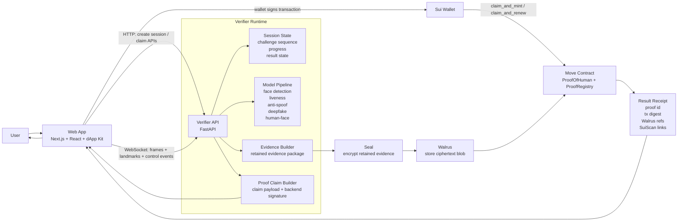
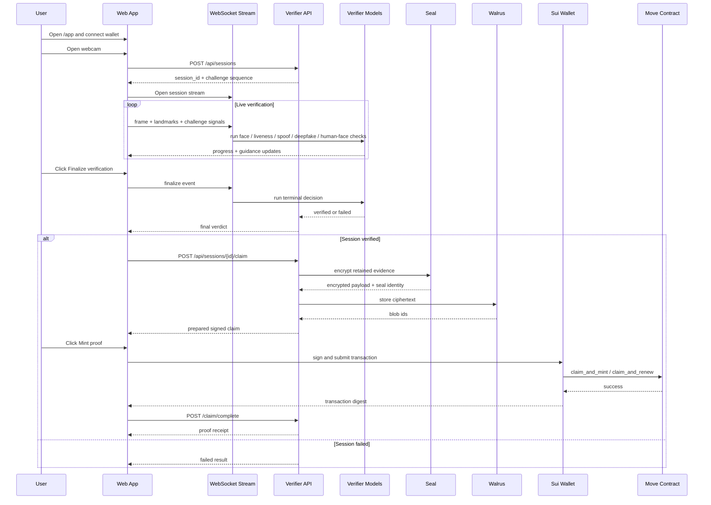

# Sui Human

Sui Human is a wallet-aware Proof-of-Human verification system that combines live liveness checks, anti-spoofing, deepfake screening, encrypted evidence retention, Walrus storage, and Sui-based proof minting.

The current product flow is:

1. Connect a Sui wallet in the web app.
2. Complete the live verification challenge.
3. Finalize verification on the verifier backend.
4. Sign the proof transaction from the frontend wallet.
5. Receive a Sui proof receipt with linked on-chain metadata.

## Tech Stack

-    Frontend application and wallet-driven verification UX
-   UI styling and frontend test coverage
-   Verification API, session orchestration, evidence assembly, and claim preparation
-    Model inference for face detection, anti-spoofing, and deepfake screening
-   Non-transferable proof contract, claim validation, renewal, and revocation
-   Encrypted evidence storage and retrieval pipeline
-   Wallet integration and shared frontend/backend contracts

## What This Repository Contains

- `apps/web`
  The Next.js application for the end-user journey, wallet connection, live camera flow, result receipt, and proof mint signing.

- `services/verifier`
  The FastAPI verifier service that manages verification sessions, model evaluation, final verdicts, encrypted evidence assembly, Walrus upload, and wallet-claim preparation.

- `contracts/move`
  The Sui Move package that defines the Proof-of-Human object, registry, claim-based mint flow, renewals, revocations, and owner checks.

- `packages/shared`
  Shared contracts and types used across the frontend and backend.

- `docs`
  Specs, implementation plans, progress checkpoints, and design artifacts.

## Core Capabilities

- Live challenge flow with webcam-based liveness interactions
- Face detection, human-face screening, anti-spoofing, and deepfake analysis
- Finalize-then-mint UX with wallet-signed proof transactions
- Claim-based Sui proof minting and renewal
- Seal-encrypted evidence payloads
- Walrus-backed encrypted evidence storage
- SuiScan-ready proof and transaction receipts

## System Architecture

### High-Level Architecture



### Layer-by-Layer Responsibilities

#### 1. Frontend Layer: `apps/web`

The frontend is the user-facing control surface for the entire journey.

It is responsible for:

- wallet connection and network context
- webcam lifecycle management
- browser-side face landmark extraction
- opening the verification WebSocket stream
- displaying challenge instructions and progress
- triggering `Finalize verification`
- requesting a prepared proof claim from the backend
- opening the wallet signature flow for the mint transaction
- showing the final proof receipt and SuiScan links

The frontend does **not** make the verification decision itself. It gathers live capture data, presents real-time feedback, and acts as the signing surface for the final on-chain proof transaction.

#### 2. Transport Layer: HTTP + WebSocket

The system uses two communication paths between the frontend and backend.

HTTP is used for control and lifecycle operations:

- `POST /api/sessions`
- `GET /api/sessions/{session_id}`
- `POST /api/sessions/{session_id}/claim`
- `POST /api/sessions/{session_id}/claim/complete`
- `POST /api/sessions/{session_id}/claim/cancel`
- `GET /api/health`

WebSocket is used for the live verification stream:

- browser sends frame snapshots, landmarks, and challenge signals
- backend sends progress, challenge updates, processing, verified, and failed events

This split keeps high-frequency capture traffic on WebSocket while preserving simple, explicit lifecycle control on REST endpoints.

#### 3. Verifier Backend: `services/verifier`

The verifier is the decision engine of the system.

Its responsibilities include:

- creating and restoring session state
- selecting and sequencing liveness challenges
- evaluating live frames against verification models
- deciding whether a session is `verified` or `failed`
- assembling the retained evidence payload
- encrypting evidence and storing it
- preparing the signed claim that the frontend wallet will submit on-chain

Internally, the verifier coordinates several sub-pipelines:

- face detection
- face quality gating
- liveness challenge completion
- anti-spoof analysis
- deepfake scoring
- human-face screening
- terminal confidence calculation
- evidence packaging
- proof claim generation

#### 4. Evidence Pipeline: Seal + Walrus

Once the backend approves a session, it moves into the evidence pipeline.

That pipeline works like this:

1. The verifier assembles the retained evidence package.
2. The evidence package is encrypted with Seal.
3. The encrypted bytes are uploaded to Walrus.
4. The backend receives:
   - `walrus_blob_id`
   - `walrus_blob_object_id`
   - `seal_identity`
5. Those references are embedded into the proof claim and later written on-chain.

This means the on-chain proof never stores raw evidence. It stores references to encrypted evidence plus the metadata needed to audit or retrieve it later.

#### 5. Smart Contract Layer: `contracts/move`

The Move package is the on-chain source of truth for proof ownership and proof metadata.

Its responsibilities include:

- minting new `ProofOfHuman` objects
- renewing existing proofs
- revoking proofs
- validating backend-signed proof claims
- preventing invalid or replayed claims
- storing:
  - proof owner
  - confidence basis points
  - expiry
  - challenge type
  - Seal identity
  - Walrus blob identifiers
  - evidence schema version
  - model hash bundle

The contract acts as the trust boundary between:

- the backend, which verifies and prepares the signed claim
- the user wallet, which authorizes the on-chain mint transaction

#### 6. Result and Receipt Layer

After a successful wallet transaction:

- the frontend reports the transaction digest back to the verifier
- the verifier finalizes the session receipt
- the app shows the proof result
- the user can inspect the proof and transaction in SuiScan

This gives the user a normal dapp-style completion flow:

- server verifies
- wallet signs
- chain records proof
- app shows receipt

### End-to-End Request Flow



### Practical Architecture Summary

From left to right, the system works like this:

1. The user opens the webcam in the frontend.
2. The frontend streams capture data to the backend over WebSocket.
3. The backend runs the verification models and decides whether the session is valid.
4. If valid, the backend encrypts the retained evidence with Seal and stores it in Walrus.
5. The backend prepares a signed proof claim for the frontend wallet.
6. The wallet submits the Sui transaction.
7. The Move contract records the proof and links the encrypted evidence references.
8. The app returns the final result receipt to the user.

## Smart Contract Stack Explained

This project uses three distinct infrastructure layers in the proof phase: Sui, Seal, and Walrus. They work together, but each one solves a different problem.

### Sui: on-chain proof ownership and audit record

Sui is the trust and ownership layer.

The Move contract stores the proof itself:

- who owns the proof
- when it was issued
- when it expires
- what challenge type was completed
- what confidence level was accepted
- which Walrus blob holds the encrypted evidence
- which Seal identity was used for the encrypted payload

In other words, Sui is where the system writes the durable proof receipt.

In this repo, the Move package is responsible for:

- minting a new `ProofOfHuman`
- renewing an existing proof
- revoking a proof
- validating signed wallet claims
- preventing replayed or expired claims

### Seal: encryption and access identity

Seal is the confidentiality layer.

Seal is used before anything is stored in Walrus. The verifier assembles the retained evidence package and encrypts it with Seal so the raw evidence is not written to storage in plaintext.

Seal gives us:

- encrypted evidence bytes
- a stable `seal_identity`

That `seal_identity` becomes the logical identifier for the encrypted evidence record. It is later written into the Sui proof so the on-chain record and the encrypted evidence can be tied together.

So Seal answers:

- how is the evidence protected?
- what encrypted payload identity are we referring to?

### Walrus: blob storage for encrypted evidence

Walrus is the storage layer.

After the evidence is encrypted with Seal, the ciphertext is uploaded to Walrus. Walrus stores the encrypted blob and returns:

- `walrus_blob_id`
- `walrus_blob_object_id`

These values are then included in the Sui proof metadata.

So Walrus answers:

- where is the encrypted evidence stored?
- how do we refer to that encrypted blob later?

### How they work together

The relationship is:

1. The verifier decides the session is valid.
2. The verifier encrypts the retained evidence with Seal.
3. The verifier stores the encrypted ciphertext in Walrus.
4. The frontend wallet signs the Sui transaction.
5. The Move contract writes the proof on-chain with:
   - proof ownership
   - Walrus blob references
   - Seal identity
   - confidence and expiry metadata

That means:

- Sui stores the proof record
- Seal protects the evidence contents
- Walrus stores the encrypted bytes

### Why the system is split this way

This separation keeps the system practical and auditable:

- raw evidence does not bloat on-chain state
- sensitive evidence is not left unencrypted in storage
- the user still gets an on-chain proof they can inspect and reference
- the app can show proof receipts and SuiScan links without exposing underlying evidence

This is the core design principle of the project:

**proof metadata on-chain, encrypted evidence off-chain, linked by stable identifiers.**

## Current User Flow

1. Open `/app`.
2. Connect a Sui wallet.
3. Start a new verification session.
4. Complete the live challenge sequence.
5. Click `Finalize verification`.
6. If the backend returns `verified`, click `Mint proof`.
7. Approve the transaction in the wallet.
8. Review the proof receipt and SuiScan links.

## Prerequisites

For the full local flow, install:

- Node.js 20+
- npm
- Python 3.11+
- Sui CLI configured for `testnet`
- Walrus CLI configured for `testnet`
- A browser wallet that can sign Sui transactions on testnet

Optional but recommended for the real pipeline:

- Local verifier model assets for face detection, anti-spoof, and deepfake evaluation
- Seal server configuration for testnet

## Local Development

### 1. Install frontend dependencies

```bash
cd /Users/skadi2910/projects/sui-liveness-detection/apps/web
npm install
```

### 2. Install verifier dependencies

```bash
cd /Users/skadi2910/projects/sui-liveness-detection/services/verifier
python3 -m venv .venv
source .venv/bin/activate
pip install -e ".[dev]"
```

### 3. Configure environment files

Frontend:

- [apps/web/.env.example](/Users/skadi2910/projects/sui-liveness-detection/apps/web/.env.example)
- local file: `apps/web/.env.local`

Verifier:

- [services/verifier/.env.example](/Users/skadi2910/projects/sui-liveness-detection/services/verifier/.env.example)
- local file: `services/verifier/.env`

At minimum, make sure these are configured for the real flow:

- frontend package/network config
- verifier Sui package id, registry object id, verifier cap id
- Walrus config path, context, and wallet path
- Seal command/server settings

### 4. Start the verifier backend

```bash
cd /Users/skadi2910/projects/sui-liveness-detection/services/verifier
source .venv/bin/activate
.venv/bin/uvicorn app.main:app --host 127.0.0.1 --port 8000 --reload
```

Backend health:

- [http://127.0.0.1:8000/api/health](http://127.0.0.1:8000/api/health)

### 5. Start the frontend

```bash
cd /Users/skadi2910/projects/sui-liveness-detection/apps/web
npm run dev
```

Frontend app:

- [http://localhost:3000/app](http://localhost:3000/app)

## Docker

The repository now includes Docker support for the frontend and backend.

The Docker stack is intended for a clean local application environment:

- `web` for the Next.js frontend
- `verifier` for the FastAPI backend
- `redis` for verifier session state

By default, the Docker compose stack is configured for a Docker-friendly local workflow:

- verifier runs with Redis enabled
- chain/storage/encryption adapters default to mock or local-safe modes
- frontend talks to the verifier through `localhost`

### Start the Docker stack

```bash
cd /Users/skadi2910/projects/sui-liveness-detection
docker compose up --build
```

### Docker endpoints

- frontend: [http://localhost:3000](http://localhost:3000)
- verifier: [http://127.0.0.1:8000/api/health](http://127.0.0.1:8000/api/health)
- redis: `localhost:6379`

### Important Docker note

The included Docker setup is best for the local app stack itself.

For the full real testnet flow with:

- wallet-signed minting
- real Sui package ids
- real Walrus uploads
- real Seal server configuration

you will usually still want to provide the relevant frontend and verifier environment values explicitly, and in some cases continue using host-installed Sui/Walrus tooling depending on your local machine and wallet setup.

So the Docker setup should be thought of as:

- a clean containerized frontend/backend runtime
- not a guarantee that every external blockchain/storage dependency is fully container-managed out of the box

## Useful Commands

### Frontend

```bash
cd /Users/skadi2910/projects/sui-liveness-detection/apps/web
npm run dev
npm run build
npm run test
```

### Verifier

```bash
cd /Users/skadi2910/projects/sui-liveness-detection/services/verifier
source .venv/bin/activate
PYTHONPATH=. pytest
```

### Shared package typecheck

```bash
cd /Users/skadi2910/projects/sui-liveness-detection/packages/shared
../../apps/web/node_modules/.bin/tsc --noEmit -p tsconfig.json
```

### Move package

```bash
cd /Users/skadi2910/projects/sui-liveness-detection
sui move build --path contracts/move
sui move test --path contracts/move
```

## Repository Layout

```text
apps/
  web/
contracts/
  move/
docs/
infra/
packages/
  shared/
services/
  verifier/
```

## Important Notes

- The verifier currently supports both real adapter modes and local development fallbacks.
- The proof mint flow is wallet-signed from the frontend, which makes failures easier to inspect in normal dapp UX.
- The verifier may report `redis: degraded` in local development when running without a dedicated Redis service. That does not block the normal single-machine testing loop.
- Proof receipt and transaction inspection are intended to happen through SuiScan links in the app flow.

## Related Docs

- [docs/17-frontend-smart-contract-integration-progress.md](/Users/skadi2910/projects/sui-liveness-detection/docs/17-frontend-smart-contract-integration-progress.md)
- [docs/15-sui-walrus-seal-implementation-plan.md](/Users/skadi2910/projects/sui-liveness-detection/docs/15-sui-walrus-seal-implementation-plan.md)
- [services/verifier/README.md](/Users/skadi2910/projects/sui-liveness-detection/services/verifier/README.md)

## Status

This repository now contains a working integrated flow for:

- verification session creation
- liveness and model-based finalization
- Seal encryption
- Walrus upload
- wallet-signed Sui proof minting

The next iterations should focus on:

- richer proof history and dashboard surfaces
- owner-side decrypt UX
- stronger cleanup and recovery around interrupted proof claim flows
