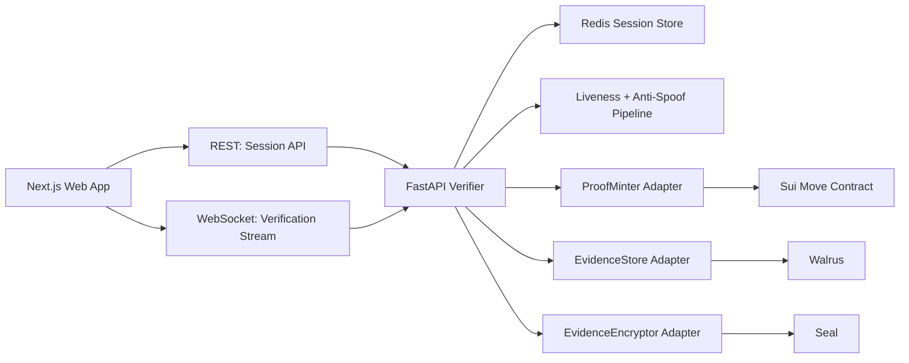

# System Architecture

## Overview

The system is organized as a monorepo with three implementation tracks and one deployment layer:

- `apps/web`: client experience and browser-side camera/landmark guidance
- `services/verifier`: authoritative backend verification pipeline
- `contracts/move`: Sui proof object and validation contract
- `infra`: local and VPS deployment assets

## Delivery Sequence

1. Build the frontend MVP demo and backend verifier in parallel against shared contracts.
2. Stabilize session flow, challenge handling, and CPU-only inference locally.
3. Integrate Sui testnet minting.
4. Add Walrus storage and Seal encryption through adapters.
5. Add zkLogin after the primary wallet flow is stable.

## Canonical Repository Shape

```text
apps/
  web/
contracts/
  move/
docs/
infra/
packages/
  shared/
services/
  verifier/
```

## Logical Architecture



## Trust Boundaries

- The browser is trusted for user interaction and low-latency guidance only.
- The verifier service is the authority for verification outcomes.
- Redis stores short-lived session state, not permanent biometric evidence.
- Sui stores proof metadata and verification references, not raw biometric media.
- Walrus and Seal are optional in the first build wave but must be integrated behind stable adapter interfaces.

## Design Decisions

### Frontend

- Use Next.js App Router.
- Keep visual language intentionally simple and monospace-led for the first MVP.
- Use browser-side landmarking for UX guidance, not as the final source of truth.

### Backend

- Use FastAPI for REST and WebSockets.
- Use Redis for challenge state, replay prevention, and TTL expiry.
- Target CPU-first inference with ONNX-friendly models for the MVP.

### Blockchain

- Start on Sui testnet.
- Model the proof as a non-transferable object by omitting `store` on the owned proof type.
- Keep Sui, Walrus, and Seal behind explicit adapters so the verifier service remains testable locally.

## Bootstrap Concerns

- The current development machine is macOS `arm64`.
- Docker assets should prefer multi-arch base images.
- ONNX runtime selection must be documented for local `arm64` development and Linux VPS deployment.
