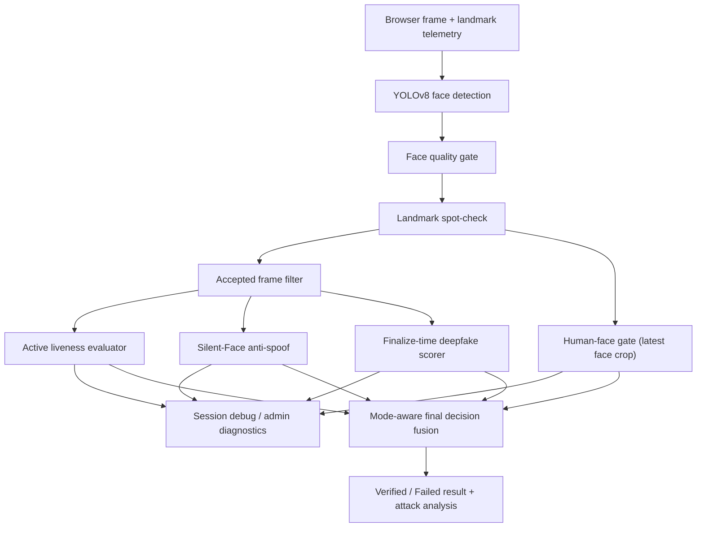

# Backend Spec

## Goal

Build a FastAPI verifier service that owns session orchestration, liveness decisioning, anti-spoof checks, and downstream proof handoff.

## Stack

- Python 3.13+
- FastAPI
- Uvicorn
- Redis
- OpenCV
- ONNX Runtime
- optional FFmpeg utilities

Bootstrap should assume `venv` + `pip` because `uv` is not currently installed locally.

## Service Responsibilities

- create verification sessions
- select and track challenge state
- accept frame or event streams over WebSocket
- run face-detection, challenge-evaluation, anti-spoof orchestration, and optional finalize-time deepfake scoring
- emit progress and final outcome payloads
- assemble the retained evidence package without persisting raw video frames by default
- encrypt the retained evidence package before durable storage
- call adapters for chain minting, storage, and encryption

## Current Verification Pipeline

The current verifier is a **gated sequential pipeline**, not a parallel fan-out pipeline.

Server-side model/runtime stack:

- YOLOv8 face detector (ONNX)
- heuristic face quality gate (OpenCV)
- Silent-Face anti-spoof evaluator (ONNX)
- Deep-Fake-Detector-v2 finalize-time scorer (ONNX)
- human-face gate (CLIP zero-shot classifier)

Browser-side assist layer:

- TensorFlow.js face landmarks
  - used to stream landmark telemetry into the verifier
  - not counted as one of the server-side verifier models

### Live Stream Path

For each streamed frame, the backend processes the current frame in this order:

1. face detection
2. face quality gate
3. landmark spot-check
4. human-face gate on the detected face crop
5. active liveness update using accepted frames
6. anti-spoof live preview using recent accepted frames

A frame is accepted for downstream liveness / spoof use only if all of these are true:

- face detected
- quality passed
- spot-check passed

### Finalize Path

When the client sends `finalize`, the verifier rebuilds the stored frame bundle and then runs:

1. face detection / quality / spot-check over stored frames
2. accepted-frame filtering
3. final liveness evaluation
4. final anti-spoof evaluation
5. final deepfake evaluation
6. human-face session summary
7. mode-aware decision fusion and confidence calculation

The deepfake head is currently finalize-time only. Anti-spoof participates in both live preview and finalize. Human-face currently runs as telemetry-first and is not enforced by default.

### Flow Diagram



### Execution Note

- The verifier is **mostly sequential**, with conditional downstream branches after accepted-frame filtering.
- It does **not** currently run the major model heads concurrently.
- If later latency becomes a problem, anti-spoof, human-face, and deepfake could be parallelized over the accepted-frame set, but that is not the current architecture.

## Proposed Layout

```text
services/verifier/
  app/
    main.py
    api/
      routes.py
      websocket.py
    core/
      config.py
      logging.py
    sessions/
      service.py
      models.py
      redis_store.py
    pipeline/
      face.py
      liveness.py
      antispoof.py
      evidence.py
    adapters/
      proof_minter.py
      evidence_store.py
      evidence_encryptor.py
```

## REST Interface

### `POST /api/sessions`

Creates a verification session.

Request:

```json
{
  "wallet_address": "0xabc...",
  "client": {
    "platform": "web",
    "user_agent": "Mozilla/5.0"
  }
}
```

Response:

```json
{
  "session_id": "sess_123",
  "status": "created",
  "challenge_type": "blink_twice",
  "expires_at": "2026-04-17T14:00:00Z",
  "ws_url": "/ws/sessions/sess_123/stream"
}
```

### `GET /api/sessions/{session_id}`

Returns current session state and final result when available.

### `GET /api/health`

Returns service, Redis, model readiness, model/runtime detail, and tuning thresholds.

### `POST /api/admin/evaluate/frame`

Admin-only QA endpoint for evaluating a single frame payload and returning stage-by-stage diagnostics.

### `POST /api/admin/evaluate/session`

Admin-only QA endpoint for evaluating a short frame batch and returning aggregate gate output plus a verdict preview.

### `POST /api/admin/calibration/append`

Admin alias for saving calibration rows.

### `POST /api/admin/attack-matrix/append`

Admin alias for saving attack-matrix rows.

## WebSocket Interface

### `GET /ws/sessions/{session_id}/stream`

Bidirectional channel for challenge progress and verification events.

Compatibility alias:

- `GET /ws/verify/{session_id}`

Client-to-server message families:

- `frame`
- `landmarks`
- `heartbeat`
- `finalize`

Server-to-client message families:

- `session_ready`
- `challenge_update`
- `progress`
- `processing`
- `verified`
- `failed`
- `error`

## Session Rules

- Session TTL defaults to 10 minutes in Redis.
- A wallet address may have at most one active verification session at a time.
- Rate limit repeated attempts per wallet for 10 minutes after a terminal state.
- Session state must survive WebSocket reconnects inside the TTL window.

## Evidence Rules

- Never persist raw video frames as the default behavior.
- The retained evidence package should include more than the final verdict alone.
- The retained evidence package should include frame hashes, challenge summary, spoof score summary, timestamps, and other audit-friendly verification context.
- The retained evidence package should be serialized as one JSON payload and encrypted before Walrus storage.
- Walrus should only receive ciphertext bytes, not plaintext evidence JSON.
- The evidence assembly layer should be independent from any specific storage provider.

## Evidence Storage Flow

1. Run the verification pipeline and determine the terminal result.
2. Assemble the retained evidence package.
3. Pass the full evidence payload to `EvidenceEncryptor`.
4. Upload the returned ciphertext bytes through `EvidenceStore`.
5. Pass the Walrus and Seal references to `ProofMinter`.
6. Return proof and storage reference fields in the final result payload when available.

## Adapter Contracts

### `ProofMinter`

- `mint_proof(session_result) -> MintResult`
- `renew_proof(wallet_address, previous_proof_id) -> RenewResult`

### `EvidenceStore`

- `put_encrypted_blob(blob_bytes, metadata) -> blob_id`
- `delete_blob(blob_id) -> bool`

The store implementation should be able to preserve Walrus lifecycle references in adapter metadata even if the initial contract returns `blob_id` only.

### `EvidenceEncryptor`

- `encrypt_for_wallet(wallet_address, payload) -> encrypted_bytes`
- `decrypt_for_dispute(policy_input) -> payload`

The encryptor should treat the payload as the whole retained evidence package, not a set of independent field encryptions.

## Backend Definition Of Done

- REST endpoints and WebSocket channel match shared contracts.
- Redis-backed session recovery works across reconnects.
- One challenge type can complete end to end with deterministic pass and fail paths.
- Minting is pluggable through `ProofMinter` and can be mocked for early frontend integration.
